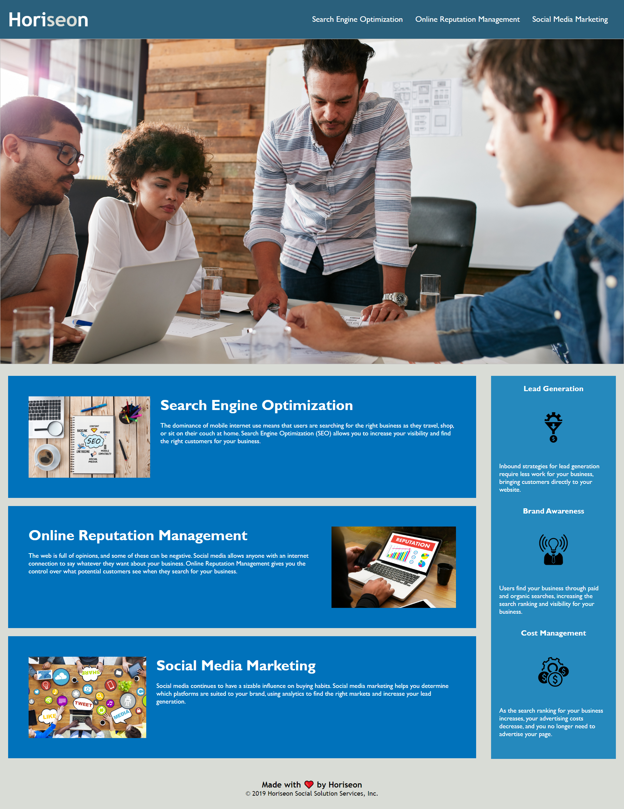

## User Story

```
AS A marketing agency
I WANT a codebase that follows accessibility standards
SO THAT our own site is optimized for search engines
```

## Acceptance Criteria

```
GIVEN a webpage meets accessibility standards
WHEN I view the source code
THEN I find semantic HTML elements
WHEN I view the structure of the HTML elements
THEN I find that the elements follow a logical structure independent of styling and positioning
WHEN I view the icon and image elements
THEN I find accessible alt attributes
WHEN I view the heading attributes
THEN they fall in sequential order
WHEN I view the title element
THEN I find a concise, descriptive title
```

## Mock-Up

The following image shows the web application's appearance and functionality:



## Link

https://github.com/Coridane/challenge01

## Resources

Semantic Names: https://www.w3schools.com/html/html5_semantic_elements.asp

Standards for Alt Text: https://blog.hubspot.com/marketing/image-alt-text (under Image Alt Text Best Practices)